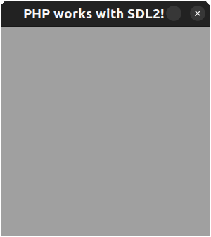

# PHP_SDL2 

Extension to create graphic applications with PHP and C library SDL2

[](./resources/Screenshot.png)

To compile need to run:
- Install SDL2 library
- `{PATH_TO_PHP}/bin/phpize`
- `./configure --with-php-config={PATH_TO_PHP}/bin/php-config`
- `make -jN && make install`
- `make test` for tests
- `php -dextension=php_sdl2 -m | grep php_sdl2` to check that ext loaded successfully
- ```php -dextension=`pwd`/modules/php_sdl2.so examples/simple_window.php``` to check that extension works properly

  -jN - where N is a count of available processes (maxValue=cores x 2) for quick compilation
  
For CLion and cmake:

`cmake -S . -B cmake-build-debug -DPHP_SOURCE="~/myphp/include/php"`

where PHP_SOURCE is path to php headers (`/path_to_php/bin/php-config --include-dir`)

Classes `SDL_Window` and `SDL_Renderer` are stubs for now. Real objects saved in global objects.
Only one window and one renderer allowed.

Additional info about an extension building:
https://www.phpinternalsbook.com/php7/build_system/building_extensions.html